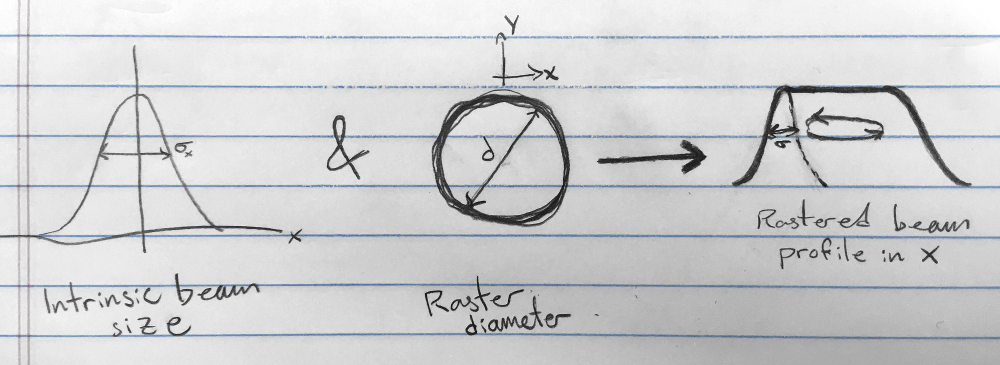
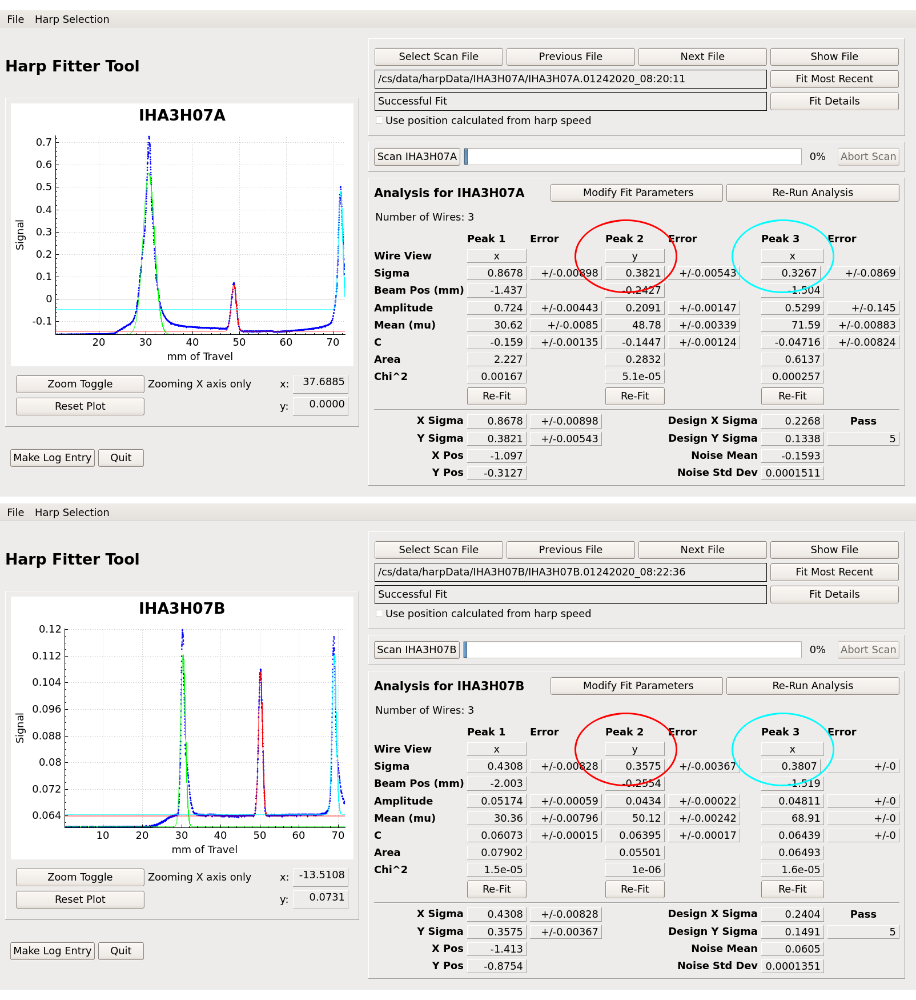

### Projecting beam width
We want to make sure the beam width at the target is small enough that
the halo doesn't hit the target cell wall. We do this by projecting the
width to the target, and choosing an appropriate raster size for that width.

As in Simona's entry [1] using distances Dave Gaskell sent me [2], we can
project the beam width from each of the harps to the target as follows:

width at target (using 3H07B) = width(3H07B) + 1.55 * [width(3H07B) - width(3H07A)]/1.41

width at target (using 3H07A) = width(3H07A) + 2.95 * [width(3H07B) - width(3H07A)]/1.41

### Choosing a raster diameter
The distribution of beam electrons incident on the target cell is determined by
the intrinstic beam size and the circular raster's diameter.



For a cryo target, the raster needs to be large enough to prevent LH2, LHe3,
etc. from boiling. The polarized 3He target does not have this concern. We
just need to make sure to keep the beam within the center of the window.
To prevent the beam halo from hitting the outer wall of the cell (which could
damage it, create extra background, etc.), we need to set an appropriate raster
given the width measured in harp scans.

If we have a narrow beam, we can accept a wider raster.
If we have a wide beam, we need the raster to be smaller.

A more principled calculation is possible, but the rule of thumb we
established on Jan 23rd, 2020 is as follows:

| Beam width at target (mm) | Raster diameter (mm)  |
| ------------------------- | --------------------- |
| < 0.300                   | 5.0                   |
| 0.300 to 0.400            | 4.5                   |
| 0.400 to 0.500            | 4.0                   |
| > 0.500                   | Request smaller width |

### Note regarding x width
Jay Benesch says [3]  there's significant background in the first x wires
of the harps. So we should use the second x wire, peak 3 in the harp fitter
tool (circled in light blue below). For y, use peak 2 (circled in red below).
The y width has tended to be pretty narrow, so we're mainly concerned with x.



### Example usage
When you run this script, it will ask you to input the instrinsic beam widths
from both harps. Then it will output the width projected to the target
as well as the corresponding raster to request from MCC. I recommend you post
an HCLOG entry with links to the harp scans as well as the info output
by this script.

```
~/a1n_project_beam_width$ ./project_beam_to_target.py
Width at IHA3H07A in mm: 0.3267
Width at IHA3H07B in mm: 0.3807

Beam width projected to target (both harps should match)
From IHA3H07A: 0.4401
From IHA3H07B: 0.4401

Raster insructions:
Request a raster diameter of 4.00 mm
```

### [citation needed]
[1] https://logbooks.jlab.org/entry/3768482

[2] https://hallcweb.jlab.org/elogs/Commissioning+Experiments+Analysis/34

[3] https://logbooks.jlab.org/entry/3751286
